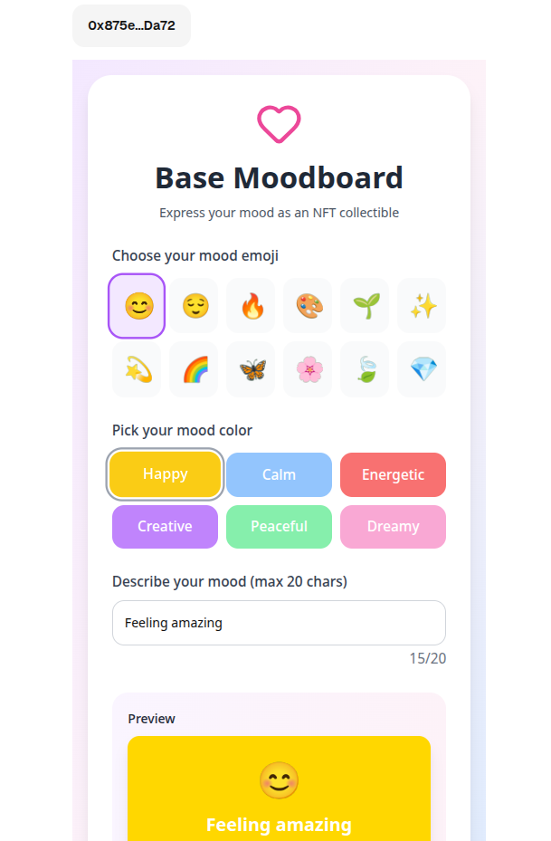

# Base Moodboard

> A Farcaster Mini App that lets users mint their daily mood as an NFT on Base blockchain

   

## 🎯 Overview

Base Moodboard is a simple yet engaging Farcaster Mini App that allows users to capture their daily emotional state as a collectible NFT on the Base blockchain. Users can express their mood through a combination of emoji, color, and short text, then mint it as a unique on-chain collectible - all with just a few taps.



**🚀 Try it now:** [https://my-minikit-app-liart.vercel.app](https://my-minikit-app-liart.vercel.app)

## ✨ Key Features

### 🎨 **Mood Expression**
- **Emoji Selection**: Choose from 12 carefully curated mood emojis
- **Color Palette**: 6 beautiful colors representing different emotional states
- **Short Text**: Express your mood in 20 characters or less
- **Live Preview**: See exactly how your mood NFT will look

### ⛓️ **Blockchain Integration**
- **Base Network**: Low-cost, fast transactions on Coinbase's L2
- **No Images Required**: Metadata stored directly on-chain
- **ERC-721 Standard**: Compatible with all major NFT marketplaces

### 🔐 **Wallet & Authentication**
- **MiniKit Integration**: Seamless wallet connection through Farcaster
- **Transaction Signing**: Users sign their own mint transactions
- **Secure**: Cryptographically verified user identity

### 📱 **Social Features**
- **Farcaster Integration**: Share minted moods directly to timeline
- **Rich Sharing**: Includes emoji, color, date, and token details
- **Timeline Visibility**: Moods appear as casts with full context

## 🏗️ Architecture

### **Frontend (React + MiniKit)**
- Built with React 18+ and Tailwind CSS
- MiniKit hooks for Farcaster integration
- Responsive design optimized for mobile
- State management with React hooks

### **Smart Contract (Solidity)**
- Simple ERC-721 implementation
- On-chain metadata storage
- Daily minting limits per user
- Gas-optimized functions

### **Integration Layer**
- MiniKit for wallet connection
- Transaction signing through Base network
- Farcaster social graph integration

## 🚀 Getting Started

### **Prerequisites**
- Node.js 18+
- npm or yarn
- Farcaster account
- Base network access

### **Installation**

```bash
# Clone the repository
git clone https://github.com/ofemeteng/base-moodboard
cd base-moodboard

# Install MiniKit and related packages
npx create-onchain --mini

# Install dependencies
npm install
npm run dev
```

### **Environment Setup**

Create a `.env.local` file:

```env
NEXT_PUBLIC_ONCHAINKIT_PROJECT_NAME=
NEXT_PUBLIC_URL=
NEXT_PUBLIC_ICON_URL=
NEXT_PUBLIC_ONCHAINKIT_API_KEY=

PINATA_JWT=

# Frame metadata
FARCASTER_HEADER=
FARCASTER_PAYLOAD=
FARCASTER_SIGNATURE=
NEXT_PUBLIC_APP_ICON=
# Optional Frame metadata items below
NEXT_PUBLIC_APP_SUBTITLE=
NEXT_PUBLIC_APP_DESCRIPTION=
NEXT_PUBLIC_APP_SPLASH_IMAGE=
NEXT_PUBLIC_SPLASH_BACKGROUND_COLOR=
NEXT_PUBLIC_APP_PRIMARY_CATEGORY=
NEXT_PUBLIC_APP_HERO_IMAGE=
NEXT_PUBLIC_APP_TAGLINE=
NEXT_PUBLIC_APP_OG_TITLE=
NEXT_PUBLIC_APP_OG_DESCRIPTION=
NEXT_PUBLIC_APP_OG_IMAGE=
```

### **Development**

```bash
# Start development server
npm run dev

# Build for production
npm run build

# Deploy to production
npm run deploy
```

## 📋 Usage

### **For Users**

1. **Open Mini App** in Farcaster: [https://my-minikit-app-liart.vercel.app](https://my-minikit-app-liart.vercel.app)
2. **Select Mood Elements**:
   - Pick an emoji that represents your feeling
   - Choose a color that matches your emotional state
   - Write a short description (1-20 characters)
3. **Preview & Connect**: Review your mood and connect wallet
4. **Mint NFT**: Sign transaction to mint your mood on Base
5. **Share**: Post your minted mood to Farcaster timeline

## 🎨 Design System

### **Color Palette**
- **Happy**: Gold (#FFD700)
- **Calm**: Sky Blue (#87CEEB)
- **Energetic**: Tomato (#FF6347)
- **Creative**: Orchid (#DA70D6)
- **Peaceful**: Pale Green (#98FB98)
- **Dreamy**: Plum (#DDA0DD)

### **Emoji Set**
😊 😌 🔥 🎨 🌱 ✨ 💫 🌈 🦋 🌸 🍃 💎

### **UI Components**
- **Gradient Backgrounds**: Dynamic based on app state
- **Rounded Design**: 3xl border radius for modern look
- **Interactive Elements**: Hover effects and animations
- **Responsive Layout**: Mobile-first design approach

## 🔒 Security Features

- **Input Validation**: Text length and content validation
- **Transaction Signing**: Users control their own private keys
- **No External Dependencies**: Metadata stored on-chain

## 📊 Contract Economics

- **Minting**: Free (only gas costs)
- **Gas Optimization**: Efficient contract design
- **No Royalties**: Simple ownership model
- **IPFS**: IPFS integration for metadata
- **Base Network**: Low transaction costs

## 🌟 Future Enhancements

### **V2 Features**
- [ ] Mood streaks and statistics
- [ ] Social mood trends and analytics
- [ ] Mood collections and themes
- [ ] Integration with other social platforms

### **Technical Improvements**
- [ ] Advanced mood analytics
- [ ] Multi-chain deployment
- [ ] Enhanced sharing features

## 🤝 Contributing

We welcome contributions! Please see our [Contributing Guidelines](CONTRIBUTING.md) for details.

### **Development Workflow**
1. Fork the repository
2. Create a feature branch
3. Make your changes
4. Add tests if applicable
5. Submit a pull request

## 📄 License

This project is licensed under the MIT License - see the [LICENSE](LICENSE) file for details.

## 🆘 Support

### **Common Issues**

**Transaction Fails**
- Ensure you have enough ETH for gas on Base
- Verify contract address is correct

**Wallet Connection Issues**
- Make sure you're using a supported Farcaster client
- Check that MiniKit is properly configured
- Try refreshing the app

**Sharing Not Working**
- Verify composeCast hook is properly imported
- Check Farcaster permissions

### **Getting Help**

- 🐦 Twitter: [@BaseMoodboard](https://x.com/BaseMoodboard)

## 🙏 Acknowledgments

- **Coinbase** for Base network and MiniKit framework
- **Farcaster** for the decentralized social protocol
- **OpenZeppelin** for secure smart contract primitives
- **React** and **Tailwind CSS** for the frontend framework

---

**Built with ❤️ for the Farcaster and Base ecosystems**

*Capture your daily mood, mint it forever* 🎨⛓️